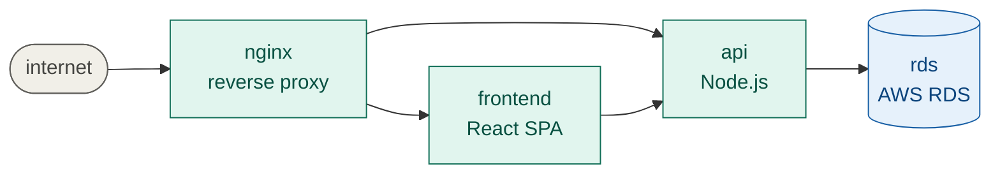

# MGTT — Model Guided Troubleshooting Tool

If you build or maintain anything with more than two components — a web app with a frontend, an API, and a database; a set of microservices behind a load balancer; a data pipeline with queues, workers, and storage — you know the drill:

Something stops working. You check the logs. Nothing obvious. You check the database. Looks fine. You check the API. Restarting. Why? You check the config. You check the deploy history. You ask the person who wrote it. They're asleep. You open three terminals and start guessing.

**The core problem:** troubleshooting distributed systems is slow, unstructured, and depends entirely on whoever happens to know the system. There's no map, no systematic narrowing, no way to know what you've already ruled out. Every incident is a fresh battle of wits.

**mgtt fixes this.** You describe your system's dependencies once in a YAML model — what depends on what, what "healthy" means for each component. When something breaks, a constraint engine walks the dependency graph, probes components in order of information value, and eliminates healthy branches. It always knows what to check next and why.

An SRE can drive the loop manually (press Y at each step). An AI agent can drive it autonomously via the same interface — mgtt is designed to be equally useful to humans and LLMs. The engine reasons; whoever's on call executes.

And before the system even exists, you can simulate failures against the model to verify the reasoning is correct — like unit tests for your architecture.

## See it in action

### Simulation: catch model gaps in CI

Write a scenario: "if rds goes down and api crash-loops, the engine should blame rds, not api."

```
$ mgtt simulate --all

  rds unavailable                          ✓ passed
  api crash-loop independent of rds        ✓ passed
  frontend crash-looping, api healthy      ✓ passed
  all components healthy                   ✓ passed

  4/4 scenarios passed
```

No running system. No credentials. Runs on every PR. If someone removes a dependency from the model, the scenario fails and the PR is blocked.

[Full simulation walkthrough](./docs/simulation-scenario.md)

### Troubleshooting: root cause in 6 probes

Monday 3am. Alert fires. You run `mgtt plan` and press Y:

```
$ mgtt plan

  -> probe nginx upstream_count
     cost: low | kubectl read-only

  ✓ nginx.upstream_count = 0   ✗ unhealthy

  -> probe api restart_count
     cost: low

  ✓ api.restart_count = 47   ✗ unhealthy

  -> probe rds available
     cost: low | AWS API read-only | eliminates PATH C if healthy

  ✓ rds.available = true   ✓ healthy       ← eliminated

  -> probe frontend ready_replicas
     cost: low | kubectl read-only | eliminates PATH A if healthy

  ✓ frontend.ready_replicas = 2   ✓ healthy  ← eliminated

  Root cause: api
  Path:       nginx <- api
  State:      degraded
  Eliminated: frontend, rds
```

The engine probed 4 components, eliminated 2 (rds healthy, frontend healthy), and found the root cause: api is crash-looping. You didn't need to know the system — the model knew it for you. An AI agent could run this same loop autonomously.

[Full troubleshooting walkthrough](./docs/troubleshooting-scenario.md)

---

## TL;DR

**The problem:** troubleshooting distributed systems is slow, unstructured, and depends on whoever happens to know the system.

**What mgtt does:**

1. You describe your system once in a YAML model (components, dependencies, what "healthy" means)
2. A constraint engine walks the dependency graph, probing components and eliminating healthy branches
3. Each probe is ranked by how much it narrows the search — the engine always picks the most informative, cheapest check next

**Two modes, same model:**

| | Design time | At 3am |
|---|---|---|
| Command | `mgtt simulate` | `mgtt plan` |
| Facts from | Scenario YAML | Real probes (kubectl, aws) |
| Needs | Nothing | Environment credentials |
| Output | Pass/fail assertions | Guided root cause |

---

## Install

```bash
# One-liner
curl -sSL https://raw.githubusercontent.com/sajonaro/mgtt/main/install.sh | sh

# Or via Go
go install github.com/sajonaro/mgtt/cmd/mgtt@latest

# Or via Docker
docker compose run --rm mgtt version
```

## Quick start

```bash
mgtt init                          # scaffold system.model.yaml
# edit it with your components and dependencies
mgtt model validate                # check the model
mgtt provider install kubernetes   # install providers
mgtt simulate --all                # run failure scenarios
mgtt plan                          # troubleshoot a live system
```

---

## The model

A YAML file describing your system: components, dependencies, and what "healthy" means. Here's the storefront from the examples above:



```yaml
# system.model.yaml
meta:
  name: storefront
  version: "1.0"
  providers:
    - kubernetes
  vars:
    namespace: production

components:
  nginx:
    type: ingress
    depends:
      - on: frontend
      - on: api

  frontend:
    type: deployment
    depends:
      - on: api

  api:
    type: deployment
    depends:
      - on: rds

  rds:
    providers:
      - aws
    type: rds_instance
    healthy:
      - connection_count < 500
```

The model is version-controlled alongside your Helm charts and Terraform.

## How it works

### Troubleshooting (`mgtt plan`)


- **model.yaml** — your system description: components, dependencies, health conditions. Written once.
- **mgtt plan** — the constraint engine. Diffs your model against observed facts, eliminates healthy branches, ranks what to check next.
- **state.yaml** — append-only log of everything observed during the incident. Timestamped, shareable, resumable.
- **diff** — the engine's output: what's broken, what's unknown, what's confirmed healthy and can be ignored.
- **next probe** — the single highest-value, lowest-cost check to run right now. Not a list of ten things — one thing.
- **providers** — community plugins that supply the vocabulary: component types, health conditions, and the commands to collect facts.

The loop repeats until one failure path remains — that's your root cause.

### Simulation (`mgtt simulate`)


- **model.yaml** — same file as troubleshooting. No separate artifact.
- **scenario.yaml** — synthetic facts you author. Instead of probing a live system, you declare what's "true": `rds: available: false`. Nothing gets touched.
- **mgtt simulate** — runs the same constraint engine against the injected facts.
- **expected plan output** — what you assert the engine *should* conclude. If rds is down and api depends on it, the cascade should appear.
- **pass / fail** — did the model reason correctly? Pass means the dependency graph and health conditions are wired right. Fail means you have a gap to fix before the real incident.
- **scenario library** — a collection of named scenarios in version control, runnable in CI.

### The engine

The constraint engine is pure: no I/O, no credentials, no side effects. It takes a model, providers, and facts as input, and returns a ranked failure path tree. The same engine powers both `mgtt simulate` and `mgtt plan` — only the source of facts differs.

## Providers

Providers teach mgtt about technologies. Each provider defines component types, observable facts, states, and failure modes — all in mgtt's vocabulary.

```
$ mgtt provider ls

  ✓ aws         v0.1.0  AWS resources
  ✓ kubernetes  v1.0.0  Kubernetes workloads
```

Install from GitHub:

```bash
mgtt provider install https://github.com/sajonaro/mgtt-provider-docker
```

[Write your own provider](./providers/README.md) — three things: a YAML vocabulary, a binary that probes, an install hook.

---

## More

- [Simulation walkthrough](./docs/simulation-scenario.md) — design-time model validation
- [Troubleshooting walkthrough](./docs/troubleshooting-scenario.md) — runtime incident response
- [Writing providers](./providers/README.md) — teach mgtt about your technology
- [CLI reference](#cli-reference) — every command
- [Full specification](./docs/specs.md) — the v1.0 spec
- [Documentation site](https://sajonaro.github.io/mgtt) — browsable docs

## CLI reference

```
mgtt init                              Scaffold system.model.yaml
mgtt model validate [path]             Validate model

mgtt provider install <name|path|url>  Install a provider
mgtt provider ls                       List providers
mgtt provider inspect <name> [type]    Inspect types

mgtt simulate --all                    Run all scenarios
mgtt simulate --scenario <file>        Run one scenario

mgtt incident start [--id ID]          Start incident
mgtt incident end                      Close incident

mgtt plan [--component NAME]           Guided troubleshooting
mgtt fact add <c> <k> <v> [--note ..]  Add observation

mgtt ls                                Components and status
mgtt ls facts [component]              Collected facts
mgtt status                            Health summary

mgtt stdlib ls                         Primitive types
mgtt stdlib inspect <type>             Type definition
```

## Design principles

- **Zero cognitive load at incident time.** The on-call engineer presses Y.
- **Engine is pure.** No I/O, no credentials. Same engine for CLI, simulation, and AI.
- **Credentials belong to the environment.** Same model as Terraform.
- **State is observed, not declared.** Component states derive from facts automatically.
- **Guided, not automated.** mgtt tells you what to check next. You decide whether to check it.

## License

MIT
