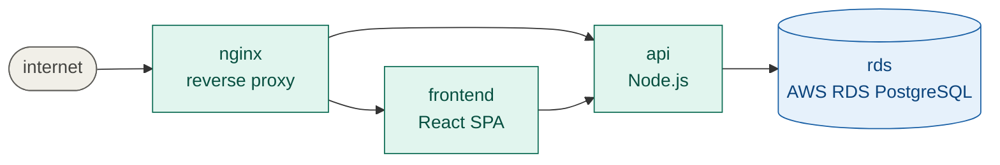

# MGTT — Model Guided Troubleshooting Tool

Troubleshooting distributed systems is usually a battle of wits — a senior engineer running kubectl commands from muscle memory, an AI listing ten things that could be wrong, a team Slack thread filling up with "did you check X?".

`mgtt` replaces that with a structured loop: describe your system once, observe facts as you go, let the constraint engine tell you what to check next. Every confirmed-healthy component gets eliminated. Every new fact narrows the search space. You always know exactly where you are in the investigation.

The result: faster root cause, no duplicated effort, and a complete incident record you didn't have to write.

## Install

```bash
# One-liner (downloads binary or builds from source)
curl -sSL https://raw.githubusercontent.com/sajonaro/mgtt/main/install.sh | sh

# Or via Go
go install github.com/sajonaro/mgtt/cmd/mgtt@latest

# Or via Docker (no install needed)
docker compose run --rm mgtt version
```

## Quick Start

### 1. Write your model

```yaml
# system.model.yaml
meta:
  name: storefront
  version: "1.0"
  providers:
    - kubernetes
  vars:
    namespace: production

components:
  nginx:
    type: ingress
    depends:
      - on: frontend
      - on: api

  frontend:
    type: deployment
    depends:
      - on: api

  api:
    type: deployment
    depends:
      - on: rds

  rds:
    providers:
      - aws
    type: rds_instance
    healthy:
      - connection_count < 500
```

### 2. Validate it

```
$ mgtt model validate

  ✓ nginx     2 dependencies valid
  ✓ frontend  1 dependency valid
  ✓ api       1 dependency valid
  ✓ rds       healthy override valid

  4 components · 0 errors · 0 warnings
```

### 3. Simulate failures before they happen

Write scenarios that inject facts and assert what the engine should conclude:

```yaml
# scenarios/rds-unavailable.yaml
name: rds unavailable
description: >
  rds stops accepting connections.
  api starts crash-looping as a result.
  engine should trace the fault to rds, not api.

inject:
  rds:
    available: false
    connection_count: 0
  api:
    ready_replicas: 0
    restart_count: 12
    desired_replicas: 3

expect:
  root_cause: rds
  path: [nginx, api, rds]
  eliminated: [frontend]
```

Run them:

```
$ mgtt simulate --all

  all components healthy                   ✓ passed
  api crash-loop independent of rds        ✓ passed
  frontend crash-looping, api healthy      ✓ passed
  rds unavailable                          ✓ passed

  4/4 scenarios passed
```

No running system. No credentials. Runs in CI on every PR.

### 4. Troubleshoot a real incident

When something breaks, `mgtt plan` walks you to the root cause:

```
$ mgtt plan

  starting from outermost component: nginx

  -> probe nginx upstream_count
     cost: low | kubectl read-only

  ✓ nginx.upstream_count = 0   ✗ unhealthy

  3 paths to investigate:
  PATH C   nginx <- api <- rds
  PATH A   nginx <- frontend
  PATH B   nginx <- api

  -> probe api ready_replicas
     cost: low | kubectl read-only | eliminates PATH C, PATH B if healthy

  ✓ api.ready_replicas = 0   ✗ unhealthy

  ...

  -> probe rds available
     cost: low | AWS API read-only | eliminates PATH C if healthy

  ✓ rds.available = true   ✓ healthy

  -> probe frontend ready_replicas
     cost: low | kubectl read-only | eliminates PATH A if healthy

  ✓ frontend.ready_replicas = 2   ✓ healthy

  Root cause: api
  Path:       nginx <- api
  State:      degraded
  Eliminated: frontend, rds
```

The engine probed 4 components, eliminated rds (healthy) and frontend (healthy), and traced the fault to api in a degraded state. You press Y at each step — or let an AI agent drive the loop.

## How It Works



`mgtt` encodes your system's dependency graph in a YAML model. A constraint engine walks the graph from the outermost component inward, probing each component and eliminating healthy branches. Each probe is ranked by information gain (how many failure paths it eliminates) divided by cost.

The same model serves two phases:

| | Design time | Runtime |
|---|---|---|
| **Input** | Scenario YAML (injected facts) | Real probes (kubectl, aws, etc.) |
| **Command** | `mgtt simulate` | `mgtt plan` |
| **Output** | Pass/fail assertions | Guided root cause |
| **Needs** | No credentials, no cluster | Environment credentials |
| **Runs in** | CI pipeline | On-call engineer's laptop |


## Two Modus Operandi

### Simulation (design time)

Write the model before the system is deployed. Simulate failure scenarios to validate that the constraint engine reasons correctly. Catch model gaps in CI before they become incident blind spots.

Full walkthrough: [Simulation Scenario](./simulation-scenario.md)


### Troubleshooting (runtime)

When an incident fires, `mgtt plan` walks you through the dependency graph. Press Y at each step. The engine picks the cheapest, most informative probe at every turn. Root cause in minutes, not hours.

Full walkthrough: [Troubleshooting Scenario](./troubleshooting-scenario.md)

## Providers

Providers are plugins that define component types, facts, probes, states, and failure modes. Two ship with v0:

```
$ mgtt provider ls

  ✓ aws         v0.1.0  AWS resources (v0 — rds_instance only)
  ✓ kubernetes  v1.0.0  Kubernetes workload and networking components
```

The kubernetes provider knows what a `deployment` is, how to probe it (`kubectl get deploy`), what states it can be in (`live`, `starting`, `degraded`, `draining`), and what failures each state can cause downstream.

## CLI Reference

```
mgtt init                              Scaffold a blank system.model.yaml
mgtt model validate [path]             Validate model against providers

mgtt provider install <name>...        Install providers
mgtt provider ls                       List installed providers
mgtt provider inspect <name> [type]    Inspect provider types

mgtt simulate --all                    Run all scenarios in scenarios/
mgtt simulate --scenario <file>        Run one scenario

mgtt incident start [--id ID]          Start an incident session
mgtt incident end                      Close the incident

mgtt plan [--component NAME]           Interactive guided troubleshooting
mgtt fact add <c> <k> <v> [--note ..]  Add a manual observation

mgtt ls                                List components and status
mgtt ls facts [component]              List collected facts
mgtt status                            One-line health summary

mgtt stdlib ls                         List primitive types
mgtt stdlib inspect <type>             Inspect a type definition
```

## Specification

The full v1.0 spec is at [specs.md](./specs.md). Key design principles:

- **Zero cognitive load at incident time.** The on-call engineer presses Y.
- **Engine is pure.** No I/O, no credentials, no side effects. Same engine for CLI, simulation, and AI.
- **Credentials belong to the environment.** Same model as Terraform.
- **State is observed, not declared.** Component states derive from facts automatically.
- **Guided, not automated.** MGTT tells you what to check next. You decide whether to check it.

## License

MIT
