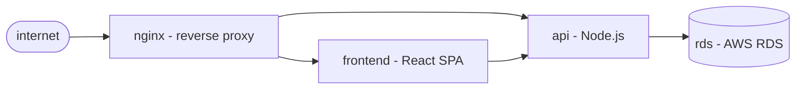

# Simulation

Simulation tests the **model's reasoning**, not the system's behavior. You inject facts, the engine reasons over them, and you assert the conclusion. No running system, no credentials, runs anywhere Go runs.

```
what it tests:     given these facts, does the engine find the right root cause?
what it doesn't:   whether the system will actually fail this way
scope:             same as a unit test — tests the thing it tests, nothing more
```

## What you can do with it

- **Model drift detection** — when the real system evolves, a stale model silently diverges from reality. A scenario that once passed and now fails tells you exactly which dependency assumption became wrong, before the model is needed at 3am.
- **Regression harness for incidents** — encode each real incident as a scenario. The engine must now identify that chain forever. Your postmortems become tests.

Additional uses ride on the same primitives: architecture unit tests (scenarios assert that refactoring doesn't break the engine's reasoning), design-time validation (write the model before the system exists), and scenario-family coverage (`--from-scenarios` iterates every enumerated chain; `--fuzz` truncates trails to test partial-information convergence).

## On this page

- [The system](#the-system) — example shape used through the page
- [Step 1 — Write failure scenarios](#step-1-write-failure-scenarios)
- [Step 2 — Run simulations](#step-2-run-simulations)
- [What a failing scenario teaches you](#what-a-failing-scenario-teaches-you)
- [Generated scenarios](#generated-scenarios-from-scenarios-and-fuzz) — `--from-scenarios` and `--fuzz`
- [Add to CI](#add-to-ci)
- [Design time / runtime duality](#design-time-runtime-duality)
- [Reference](#reference)

---

## The system

Same four-component storefront as the [quickstart](../getting-started/quickstart.md) and [troubleshooting walkthrough](troubleshooting.md) — nginx fronting a React frontend and a Node.js API, backed by RDS:



If you haven't seen the model yaml, read the [quickstart's Step 2](../getting-started/quickstart.md#step-2-write-the-model) first and come back. From here we focus on the scenario half.

---

## Step 1 — Write failure scenarios

Each scenario injects a set of facts and asserts what the engine should conclude.

### Scenario 1: RDS goes down

```yaml
# scenarios/rds-unavailable.yaml
name: rds unavailable
description: >
  rds stops accepting connections. api crash-loops as a result.
  engine should trace the fault to rds, not api.

inject:
  rds:
    available: false
    connection_count: 0
  api:
    ready_replicas: 0
    restart_count: 12
    desired_replicas: 3

expect:
  root_cause: rds
  path: [nginx, api, rds]
  eliminated: [frontend]
```

### Scenario 2: API crash-loops, RDS healthy

```yaml
# scenarios/api-crash-loop.yaml
name: api crash-loop independent of rds
description: >
  api crash-loops due to a code error. rds is healthy.
  engine should find api as root cause and eliminate rds.

inject:
  api:
    ready_replicas: 0
    restart_count: 24
    desired_replicas: 3
  rds:
    available: true
    connection_count: 120

expect:
  root_cause: api
  path: [nginx, api]
  eliminated: [rds, frontend]
```

### Scenario 3: Frontend degraded, API healthy

```yaml
# scenarios/frontend-degraded.yaml
name: frontend crash-looping, api healthy
description: >
  frontend pods are crash-looping. api and rds are healthy.
  engine should find frontend as root cause.

inject:
  frontend:
    ready_replicas: 0
    restart_count: 8
    desired_replicas: 2
  api:
    ready_replicas: 3
    desired_replicas: 3
    endpoints: 3
  rds:
    available: true
    connection_count: 98

expect:
  root_cause: frontend
  path: [nginx, frontend]
  eliminated: [api, rds]
```

### Scenario 4: Everything healthy

```yaml
# scenarios/all-healthy.yaml
name: all components healthy
description: >
  verifies the engine does not surface false positives.

inject:
  nginx:
    upstream_count: 4
  frontend:
    ready_replicas: 2
    desired_replicas: 2
    endpoints: 2
  api:
    ready_replicas: 3
    desired_replicas: 3
    endpoints: 3
  rds:
    available: true
    connection_count: 87

expect:
  root_cause: none
  eliminated: [nginx, frontend, api, rds]
```

---

## Step 2 — Run simulations

```bash
$ mgtt simulate --all

  all components healthy                   ✓ passed
  api crash-loop independent of rds        ✓ passed
  frontend crash-looping, api healthy      ✓ passed
  rds unavailable                          ✓ passed

  4/4 scenarios passed
```

All four pass. The engine correctly:

- Traces rds failure through api to nginx (scenario 1)
- Identifies api as root cause when rds is healthy (scenario 2)
- Finds frontend via the nginx-frontend path (scenario 3)
- Reports no false positives when everything is healthy (scenario 4)

---

## What a failing scenario teaches you

Suppose you wrote scenario 3 without injecting `restart_count` for frontend:

```yaml
inject:
  frontend:
    ready_replicas: 0
    # restart_count missing!
    desired_replicas: 2
```

The simulation would fail — the engine can't determine if frontend is `degraded` (crash-looping) or `starting` (still initializing). Without `restart_count`, the kubernetes provider resolves the state to `starting`, not `degraded`.

This is the engine correctly applying the provider's state definitions:

```
starting:   ready_replicas < desired_replicas  (restart_count not checked)
degraded:   ready_replicas < desired_replicas  AND  restart_count > 5
```

The failure reveals a subtlety: **a deployment that's still starting looks the same as one that's crash-looping until you check restart_count.** You learn this at design time, not at 3am.

The fix: inject `restart_count: 8` to signal crash-looping, or adjust your scenario to test the `starting` state specifically.

---

## Generated scenarios — `--from-scenarios` and `--fuzz`

Hand-authored scenarios under `scenarios/` are one input. Once you have a `scenarios.yaml` sidecar (generated by `mgtt model validate --write-scenarios`), two further simulate modes use it:

```bash
# Iterate every enumerated scenario as its own test case.
# Asserts the occam strategy identifies each chain's root from its terminal facts.
mgtt simulate --from-scenarios

# Convergence fuzz — N iterations, each picks a random enumerated scenario
# and truncates its fact trail at a random point; asserts the engine still
# converges to the right root.
mgtt simulate --fuzz 500 --fuzz-seed 42
```

`--from-scenarios` catches regressions in the **strategy** layer (Occam / live-set); `--fuzz` catches them under partial-information conditions (what happens when the operator stops probing early).

Both are additive — hand-authored scenarios still run under `--all` and remain the right place for narrative-driven assertions.

### Gap detection

If a hand-authored scenario implies a root cause (or a chain) that the enumerator didn't surface, `mgtt simulate` emits a warning pointing to the model gap:

```
⚠ scenarios/frontend-degraded.yaml implies a root cause (frontend) not enumerated
  in scenarios.yaml. Consider running `mgtt validate --write-scenarios` or
  checking that frontend's type declares the right triggered_by labels.
```

See [`scenarios.yaml` reference](../reference/scenarios-yaml.md) for the generated sidecar.

---

## Add to CI

```yaml
# .github/workflows/mgtt.yaml
name: model validation

on: [push, pull_request]

jobs:
  validate:
    runs-on: ubuntu-latest
    steps:
      - uses: actions/checkout@v5

      - name: install mgtt
        run: |
          curl -sSL https://raw.githubusercontent.com/mgt-tool/mgtt/main/install.sh | sh

      - name: validate model
        run: mgtt model validate

      - name: run scenarios
        run: mgtt simulate --all
```

No credentials. No cluster. Runs on every PR.

If someone edits `system.model.yaml` and removes the `api -> rds` dependency, the `rds-unavailable` scenario fails immediately. The PR is blocked. The blind spot never reaches production.

---

## Design time / runtime duality

The same `system.model.yaml` serves both phases:

| | Design time | Runtime |
|---|---|---|
| Facts source | `scenarios/*.yaml` (injected) | Live probes via installed providers |
| Command | `mgtt simulate` | `mgtt plan` |
| Needs | Nothing — no credentials, no cluster | Environment credentials |
| Runs in | CI pipeline | On-call engineer's laptop |
| Tests | Model reasoning | Model reasoning + real system |

The model is the architectural decision record. The scenarios are the test suite for the model's reasoning. Together they mean that by the time the system is deployed, the failure detection has already been validated.

See [Troubleshooting](troubleshooting.md) for the runtime side.

---

## Reference

- [Scenario Schema Reference](../reference/scenario-schema.md) — hand-authored `scenarios/*.yaml`
- [`scenarios.yaml` Reference](../reference/scenarios-yaml.md) — the generated sidecar `--from-scenarios` and `--fuzz` consume
- [Type Catalog](../reference/type-catalog.md) — available facts per type (what to inject)
- [Model Schema Reference](../reference/model-schema.md) — every field in `system.model.yaml`
