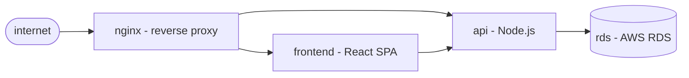

# Troubleshooting

Troubleshooting is mgtt's whole reason for being. Alert fires at 3am; you run `mgtt diagnose` and the engine eliminates healthy branches of the dependency graph until one root cause remains — 4 to 6 probes, not the 20+ guesses a cold brain would make at that hour.

## What you can do with it

- **Find root cause in minutes, not hours** — the constraint engine walks your dependency graph, probing in order of information value. Typical incidents resolve in 4–6 probes. The model *is* the institutional memory, so someone who didn't build the system can run diagnose and land on the same root cause the architect would.
- **Safe by default, even under partial visibility** — read-only probes only (`--on-write fail` enforces it); when a probe hits an RBAC hole or a transient throttle the fact degrades to unresolved and the engine keeps going, flagging how much of the picture was blocked rather than aborting. A locked-down SRE, a CI role, an LLM agent — all work against the same engine.

## On this page

- [The system](#the-system)
- [Setup (done once)](#setup-done-once)
- [The incident](#the-incident) — the actual run
- [Summary](#summary)
- [Alternative entry points](#alternative-entry-points)
- [Before the incident](#before-the-incident) — what to have ready
- [Reference](#reference)

---

## The system

A storefront running on EKS — nginx fronting a React frontend and a Node.js API, backed by an AWS RDS database.



---

## Setup (done once)

One-off, done by whoever knows the system — *not during an incident*. Full steps live in the [quickstart](../getting-started/quickstart.md); the short version is:

1. Install providers — `mgtt provider install kubernetes aws`.
2. Write `system.model.yaml` — components, dependencies, `healthy:` overrides. Commit alongside your Helm charts and Terraform.
3. Validate — `mgtt model validate`.

The rest of this page assumes those three are done and walks through the moment something breaks.

---

## The incident

*Monday 08:14 UTC. Alert fires: "503 errors on checkout."*

### Start the incident

```bash
$ mgtt incident start

  ✓ inc-20240205-0814-001 started
```

### Run the guided plan

```bash
$ mgtt plan

  starting from outermost component: nginx

  -> probe nginx upstream_count
     cost: low | kubectl read-only

  run? [Y/n] y

  ✓ nginx.upstream_count = 0   ✗ unhealthy

  3 paths to investigate:
  PATH A   nginx <- frontend
  PATH B   nginx <- api
  PATH C   nginx <- api <- rds

  -> probe api endpoints
     cost: low | eliminates PATH B, PATH C if healthy

  run? [Y/n] y

  ✓ api.endpoints = 0   ✗ unhealthy

  -> probe api ready_replicas
     cost: low | kubectl read-only

  run? [Y/n] y

  ✓ api.ready_replicas = 0   ✗ unhealthy

  -> probe api restart_count
     cost: low

  run? [Y/n] y

  ✓ api.restart_count = 47   ✗ unhealthy

  -> probe rds available
     cost: low | AWS API read-only | eliminates PATH C if healthy

  run? [Y/n] y

  ✓ rds.available = true   ✓ healthy

  -> probe frontend ready_replicas
     cost: low | kubectl read-only | eliminates PATH A if healthy

  run? [Y/n] y

  ✓ frontend.ready_replicas = 2   ✓ healthy

  Root cause: api
  Path:       nginx <- api
  State:      degraded
  Eliminated: frontend, rds
```

The engine probed 4 components in 6 steps. It eliminated rds (healthy) and frontend (healthy), and traced the fault to api — crash-looping with 47 restarts and 0 of 3 replicas ready.

### Check logs, record findings

```bash
$ kubectl logs deploy/api -n production --previous | tail -3
Error: Cannot find module './config/feature-flags'

$ mgtt fact add api startup_error "missing module: ./config/feature-flags" \
      --note "kubectl logs --previous"

$ mgtt fact add api last_deploy_at "2024-02-05T07:50:00Z" \
      --note "deploy 24min before incident"
```

### Close the incident

```bash
$ mgtt incident end

  inc-20240205-0814-001   duration: 14 minutes

  ✗ api       crash-looping
              startup_error: missing module ./config/feature-flags
              last_deploy:   07:50Z (24min before incident)
  ✓ rds       healthy · eliminated
  ✓ frontend  healthy · eliminated

  probes: 6 · facts: 8

  ✓ closed · state file: ./inc-20240205-0814-001.state.yaml
```

The state file is the incident record — timestamped, structured, complete. No separate postmortem write-up needed for the facts.

---

## Summary

What the on-call engineer did:

```
mgtt incident start
mgtt plan
y · y · y · y · y · y
mgtt fact add (x2, manual observations)
mgtt incident end
```

**14 minutes. 6 probes. Root cause identified. No system knowledge required at incident time.**

All the system knowledge was encoded in the model beforehand. The engineer just pressed Y.

---

## Alternative entry points

The example above starts from the outermost component (nginx) and works inward. Two alternatives when you already have information:

```bash
# Start from a known-bad component
mgtt plan --component api

# Pre-load a fact from an alert, then plan
mgtt fact add api error_rate 0.94 --note "datadog alert"
mgtt plan --component api
```

---

## Autopilot mode — `mgtt diagnose`

Same engine, no prompts. `mgtt diagnose` runs the probe loop end-to-end until one of:

- a single failure chain survives (root cause),
- every chain is eliminated (no failure found),
- the probe budget or deadline is reached,
- the next probe would require writes.

```bash
$ mgtt diagnose --suspect api --max-probes 10

  ▶ probe nginx upstream_count         ✓ 0        ✗ unhealthy
  ▶ probe api ready_replicas           ✓ 0        ✗ unhealthy
  ▶ probe rds available                ✓ true     ✓ healthy  ← eliminated
  ▶ probe frontend ready_replicas      ✓ 2        ✓ healthy  ← eliminated

  Root cause: api.degraded
  Chain:      nginx ← api
  Probes run: 4/10   Time: 1.2s/5m
```

Flags ([full list](../reference/cli.md)):

| Flag | Purpose |
|------|---------|
| `--suspect api,db.down` | Soft prior — components (or `component.state`) you already think are broken |
| `--readonly-only` | (default `true`) refuse probes whose provider isn't `read_only: true` |
| `--max-probes N` | Budget — stop after N probes (default 20) |
| `--deadline 5m` | Wall-clock deadline |
| `--on-write pause\|run\|fail` | What to do when the next probe would write |

### When `mgtt diagnose` needs an operator

If a component falls back to the built-in generic type — no typed provider matches its `type:` — there's no shell command to run. Diagnose prompts you per fact: `healthy / unhealthy / skip`. This requires an interactive terminal; redirecting stdin from `/dev/null` exits early with an actionable error.

### `diagnose` vs `plan`

| | `mgtt plan` | `mgtt diagnose` |
|---|---|---|
| Prompts | Y/n per probe | None (autopilot) |
| Needs | operator in the loop | nothing, by default |
| Output | per-step | single final report |
| Fits | live incident, operator-led | AI agent driver, unattended CI dry-run, large probe budgets |

Both consume the same `system.model.yaml`. `diagnose` additionally reads [`scenarios.yaml`](../reference/scenarios-yaml.md) when present to pick probes more aggressively via the `occam` strategy.

---

## Before the incident

The model and failure scenarios can be validated before the system is deployed. See [Simulation](simulation.md) for the design-time workflow — writing scenarios, running them in CI, and what failing scenarios reveal about the model.

The same `system.model.yaml` serves both phases. The scenarios written at design time are the tests that prevent model gaps from becoming incident blind spots.

---

## Reference

- [Model Schema Reference](../reference/model-schema.md) — every field in `system.model.yaml`
- [Type Catalog](../reference/type-catalog.md) — available types, facts, and states
- [CLI Reference](../reference/cli.md) — all commands
