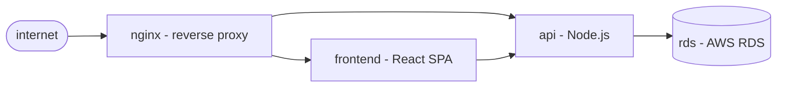

# Quick Start

A complete end-to-end example: write a model, write a scenario, validate, simulate. Everything on this page is copy-pasteable — you can have a working mgtt setup in 5 minutes.

## On this page

1. [Install](#1-install)
2. [Scaffold the model](#2-scaffold-the-model)
3. [Validate the model](#3-validate-the-model)
4. [Write failure scenarios](#4-write-failure-scenarios)
5. [Simulate](#5-simulate)
6. [Generate the scenario sidecar](#6-generate-the-scenario-sidecar)
7. [Troubleshoot a live system](#7-troubleshoot-a-live-system)
- [What you have now](#what-you-have-now)
- [Next steps](#next-steps)

---

## 1. Install

```bash
curl -sSL https://raw.githubusercontent.com/mgt-tool/mgtt/main/install.sh | sh
```

Or: `go install github.com/mgt-tool/mgtt/cmd/mgtt@latest`

## 2. Scaffold the model

```bash
mgtt init
```

This creates `system.model.yaml`. Edit it to describe your system. Here's the storefront example — an nginx reverse proxy fronting a React frontend and a Node.js API, backed by an AWS RDS database:



```yaml
# system.model.yaml
meta:
  name: storefront
  version: "1.0"
  providers:
    - kubernetes
  vars:
    namespace: production

components:
  nginx:
    type: ingress
    depends:
      - on: frontend
      - on: api

  frontend:
    type: deployment
    depends:
      - on: api

  api:
    type: deployment
    depends:
      - on: rds

  rds:
    providers:
      - aws
    type: rds_instance
    healthy:
      - connection_count < 500
```

**What each field means:**

- `meta.providers` — which providers supply the types used in this model
- `meta.vars` — variables substituted into probe commands (e.g., `{namespace}`)
- `components.<name>.type` — a type defined by a provider (see [Type Catalog](../reference/type-catalog.md))
- `components.<name>.resource` — optional upstream resource id the provider probes. Lets you keep readable component keys (`rds:`) while the probe hits the real AWS/kubectl resource (`flowers-stage-rds`). Supports `{key}` placeholders from `meta.vars`.
- `components.<name>.depends` — list of components this one depends on
- `components.<name>.healthy` — override conditions (in addition to the provider's defaults)
- `components.<name>.providers` — per-component provider override (rds uses `aws`, not `kubernetes`)

Full schema: [Model Schema Reference](../reference/model-schema.md)

## 3. Validate the model

```bash
$ mgtt model validate

  ✓ nginx     2 dependencies valid
  ✓ frontend  1 dependency valid
  ✓ api       1 dependency valid
  ✓ rds       healthy override valid

  4 components · 0 errors · 0 warnings
```

## 4. Write failure scenarios

Scenarios inject synthetic facts and assert what the engine should conclude. Create a `scenarios/` directory alongside your model.

### Scenario: RDS goes down

When the database stops accepting connections, the API crash-loops. The engine should trace the fault to rds, not blame api.

```yaml
# scenarios/rds-unavailable.yaml
name: rds unavailable
description: >
  rds stops accepting connections. api crash-loops as a result.
  engine should trace the fault to rds, not api.

inject:
  rds:
    available: false
    connection_count: 0
  api:
    ready_replicas: 0
    restart_count: 12
    desired_replicas: 3

expect:
  root_cause: rds
  path: [nginx, api, rds]
  eliminated: [frontend]
```

### Scenario: API crash-loops, RDS healthy

A code error crashes the API. RDS is fine. The engine should identify api as the root cause.

```yaml
# scenarios/api-crash-loop.yaml
name: api crash-loop independent of rds
description: >
  api crash-loops due to a code error. rds is healthy.
  engine should find api as root cause and eliminate rds.

inject:
  api:
    ready_replicas: 0
    restart_count: 24
    desired_replicas: 3
  rds:
    available: true
    connection_count: 120

expect:
  root_cause: api
  path: [nginx, api]
  eliminated: [rds, frontend]
```

### Scenario: Everything healthy (no false positives)

```yaml
# scenarios/all-healthy.yaml
name: all components healthy
description: verifies the engine does not surface false positives.

inject:
  nginx:
    upstream_count: 4
  frontend:
    ready_replicas: 2
    desired_replicas: 2
    endpoints: 2
  api:
    ready_replicas: 3
    desired_replicas: 3
    endpoints: 3
  rds:
    available: true
    connection_count: 87

expect:
  root_cause: none
  eliminated: [nginx, frontend, api, rds]
```

**What each field means:**

- `inject.<component>.<fact>` — set a fact value. Fact names come from the provider's type definition (see [Type Catalog](../reference/type-catalog.md))
- `expect.root_cause` — which component the engine should identify (`none` if all healthy)
- `expect.path` — the failure path from outermost to root cause
- `expect.eliminated` — components confirmed healthy and removed from investigation

Full schema: [Scenario Schema Reference](../reference/scenario-schema.md)

## 5. Simulate

```bash
$ mgtt simulate --all

  rds unavailable                          ✓ passed
  api crash-loop independent of rds        ✓ passed
  all components healthy                   ✓ passed

  3/3 scenarios passed
```

No running system. No credentials. Runs on every PR.

## 6. Generate the scenario sidecar

```bash
$ mgtt model validate --write-scenarios

  wrote 14 scenarios to scenarios.yaml
```

`scenarios.yaml` enumerates every plausible failure chain your model can produce. Commit it. CI drift-checks it on every PR (runs via `mgtt model validate` or the fast `--check-scenarios` lane). [Full reference](../reference/scenarios-yaml.md).

## 7. Troubleshoot a live system

When something actually breaks, use the same model with real probes. Interactive:

```bash
mgtt provider install kubernetes aws   # one-time setup
mgtt incident start
mgtt plan                              # press Y at each probe
mgtt incident end
```

Or hand the loop to the autopilot:

```bash
mgtt diagnose --max-probes 15 --suspect api
```

`diagnose` reads the `scenarios.yaml` you committed in step 6 and eliminates whole failure branches before running a probe. No Y/n prompts — fits AI-agent drivers and unattended dry-runs.

(See [Provider Install Methods](../concepts/provider-install-methods.md) for alternatives like image install.)

[Full troubleshooting walkthrough](../concepts/troubleshooting.md)

---

## What you have now

```
your-project/
├── system.model.yaml          # your system description
├── scenarios.yaml             # auto-generated sidecar (committed)
├── scenarios/
│   ├── rds-unavailable.yaml   # hand-authored failure scenario
│   ├── api-crash-loop.yaml    # hand-authored failure scenario
│   └── all-healthy.yaml       # no-false-positive check
└── .github/workflows/
    └── mgtt.yaml              # CI validation (optional)
```

### Add to CI (optional)

```yaml
# .github/workflows/mgtt.yaml
name: model validation
on: [push, pull_request]

jobs:
  validate:
    runs-on: ubuntu-latest
    steps:
      - uses: actions/checkout@v5
      - name: install mgtt
        run: curl -sSL https://raw.githubusercontent.com/mgt-tool/mgtt/main/install.sh | sh
      - name: validate model
        run: mgtt model validate
      - name: run scenarios
        run: mgtt simulate --all
```

## Next steps

- [Model Schema Reference](../reference/model-schema.md) — every field in `system.model.yaml`
- [Scenario Schema Reference](../reference/scenario-schema.md) — every field in scenario files
- [Type Catalog](../reference/type-catalog.md) — all provider types, facts, and states
- [Simulation deep dive](../concepts/simulation.md) — what failing scenarios teach you
- [Troubleshooting walkthrough](../concepts/troubleshooting.md) — the runtime loop
